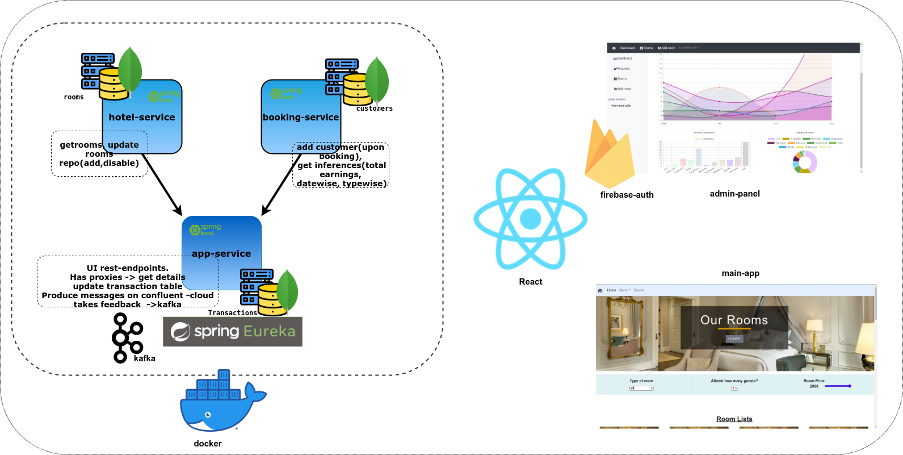

# Spring-boot Microservices implementation.

**case-study**: Hotel reservation system 
This project uses 3 microservices and client side discovery using **Eureka-naming-server** 
Uses Mongodb as the persistance database.
UI - React. 

## Project-overview:



**admin-panel**: 
- **Sales analysis** showing trends in *buying pattern, earning by each category and top-seller*: Using chartjs.
- Add rooms or disable existing ones: It provides a way so that the admin can add more rooms or disble existing one so that no more booking for that can be done.  
    
**main-app**: 
- Provides the functionality to book a room, filter a room based on size, price, category. 
- Take feedback and do *sentiment-analysis* on the feedback with python. produce message via kafka. 
- Checkout functionality and each transactions are logged into confluent cloud(cloud-native, fully managed event streaming platform powered by Apache Kafka)


## Files
*Example considered: Hotel reservation.*  
- booking-service: Microservice that provide details regarding. Rest endpoints to facilate customer bookings, get aggregate results regarding earnings.  
- hotel-service: Microservice that provide details regarding rooms available. Rest end points for getting rooms, add or disable rooms etc.  
- demo-app-service: Microservice that call the above two microservices. Uses **feign clients** . Driver Application.  **also pushes the transactions messages to confluent cloud**
- Eureka-naming-server: For client side discovery.


## Docker file and Docker-compose

In POM.xml add the final name to your spring-boot application.
```
<build>
	<finalName>demo-app-service</finalName>
</build
```
1. Package the project. **./mvnw package**
2. docker-file
```
FROM openjdk:11.0-slim
ARG JAR_FILE=target/*.jar
COPY ${JAR_FILE} app.jar
ENTRYPOINT ["java","-jar","/app.jar"]
```
3. docker build -t sourabhhbar/[image-name] .

Or Build-packs
> ./mvnw spring-boot:build-image   

Check docker images.

## Docker-compose
```
 docker pull sourabhhbar/eureka-naming-server
 docker pull sourabhhbar/demo-app-service
 docker pull sourabhhbar/booking-service
 docker pull sourabhhbar/hotel-service
```
So after individual images are pulled. Docker-compose is used to run the individual containers.  
But before that, create a new external network so that those **containers(microservices)** can exchange information with each other.  

> $ docker network create -d bridge micro-net   
 

```
version: '3.8'

services:
  database:
    container_name: mongodb
    image: mongo
    command: mongod
    ports:
    - 27018:27017
    restart: always
    volumes:
    - mongodata:/data/db

  eureka-naming-server:
    image: sourabhhbar/eureka-naming-server:latest
    container_name: eureka-naming-server
    restart: always
    ports:
    - 8761:8761
    depends_on:
      - database

  booking-service:
    image: sourabhhbar/booking-service:latest
    container_name: booking-service
    restart: always
    environment:
      - eureka.client.serviceUrl.defaultZone=http://eureka-naming-server:8761/eureka
      - spring.data.mongodb.host=database
      - spring.data.mongodb.port=27017
      - spring.data.mongodb.database=casestudy
    ports:
    - 8082:8082
    depends_on:
      - eureka-naming-server
    links:
      - eureka-naming-server
      - database

  hotel-service:
    image: sourabhhbar/hotel-service:latest
    container_name: hotel-service
    restart: always
    environment:
      - eureka.client.serviceUrl.defaultZone=http://eureka-naming-server:8761/eureka
      - spring.data.mongodb.host=database
      - spring.data.mongodb.port=27017
      - spring.data.mongodb.database=casestudy
    ports:
    - 8081:8081
    depends_on:
      - eureka-naming-server
    links:
      - eureka-naming-server
      - database
  demo-app-service:
    image: sourabhhbar/demo-app-service:latest
    container_name: demo-app-service
    restart: always
    environment:
      - eureka.client.serviceUrl.defaultZone=http://eureka-naming-server:8761/eureka
      - spring.data.mongodb.host=database
      - spring.data.mongodb.port=27017
      - spring.data.mongodb.database=casestudy
    ports:
    - 8083:8083
    depends_on:
      - eureka-naming-server
    links:
      - eureka-naming-server
      - database

networks:
  default:
    external:
      name: micro-net
volumes:
  mongodata:
    driver: local
    


```
(a yaml file is also in the eureka-naming-service directory)


## Todo:
 jenkins, k8s, 
